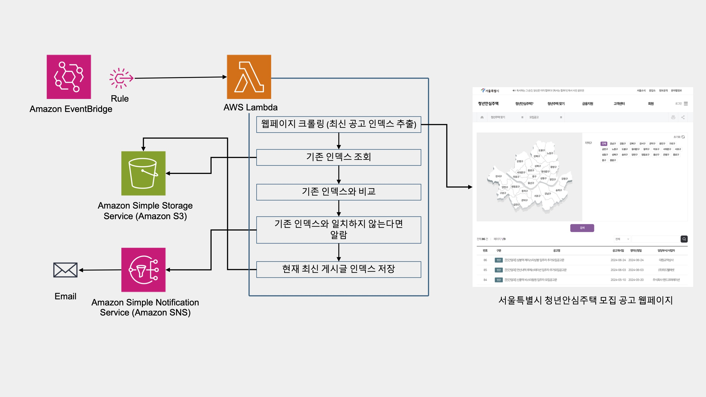
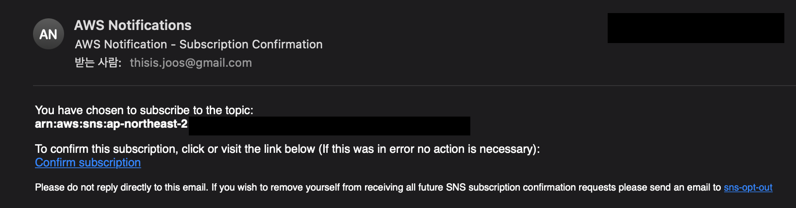
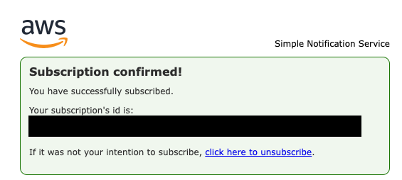

# 서울특별시 청년안심주택 모집공고 게시 알리미
[서울특별시 청년안심주택 모집공고 바로가기](https://soco.seoul.go.kr/youth/bbs/BMSR00015/list.do?menuNo=400008)

이 서비스는 서울특별시 청년안심주택의 새로운 모집공고가 올라올 경우 등록한 이메일 주소로 알림 메일을 보내주는 서비스입니다.

---

## Architecture


---

## Key Components:

- [Amazon EventBridge](https://aws.amazon.com/ko/eventbridge/): A serverless event bus that connects applications using events from different sources..
- [AWS Lambda](https://aws.amazon.com/ko/lambda//) + [AWS Lambda](https://aws.amazon.com/lambda/): A serverless compute service that runs code in response to events without provisioning or managing servers.
- [Amazon S3](https://aws.amazon.com/ko/s3//): An object storage service that provides scalable, durable, and secure storage for any type of data.
- [Amazon Simple Notification Service](https://aws.amazon.com/ko/sns/): A fully managed messaging service for both application-to-application and application-to-person communication.

---

## Deploy

> [!Important]
> - You have installed the latest version of [AWS CLI](https://docs.aws.amazon.com/cli/latest/userguide/cli-chap-welcome.html)
> - You have an [AWS account](https://aws.amazon.com/free/)
> - You have the necessary permissions to create and manage AWS resources


### Prerequisites

1. Clone the repository:
    ```
    git clone https://github.com/thisIsJooS/youth-house-recruitment-notifier.git
    ```

### Step 1: Deploy 

1. Move directory:
    ```
    cd youth-house-recruitment-notifier
   ```

2. Configure your AWS credentials:
    ```
    aws configure
    ```

3. Deploy CloudFormation stacks:
   ```
   aws cloudformation create-stack \
    --stack-name NotifierStack \
    --template-body file://notifier-template.yaml \
    --capabilities CAPABILITY_NAMED_IAM \
    --parameters ParameterKey=SubscriptionEmail,ParameterValue=<Your Email>
   ```
   Please replace <Your Email> with the email address where you want to receive notifications.


### Step 2: Confirm 
1. Confirm subscription:   
   A subscription confirmation email will have been sent to the registered email. Please click the hyperlink 'Confirm subscription'.
   
   
   


2. Wait until the stack creation is complete:
   ```
   aws cloudformation wait stack-create-complete --stack-name NotifierStack
   ```
   It waits until the stack creation is complete. If the stack is successfully created, the command will exit, and if it fails, an error message will be displayed.

---
### Remove resources

> [!Important]
> Please be mindful of the costs for all deployed resources. Make sure to delete resources after you are finished using them.

```
aws cloudformation delete-stack --stack-name NotifierStack
```

--- 

## Result
You will receive an email notification every day at 9 AM KST when a new announcement is posted.


---
## Contacts

- thisis.joos@gmail.com

## License

This library is licensed under the MIT-0 License. See [the LICENSE file](./LICENSE).