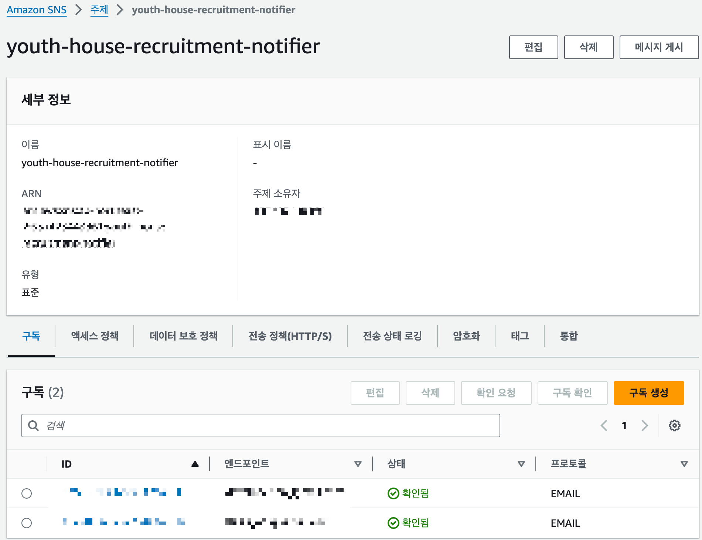
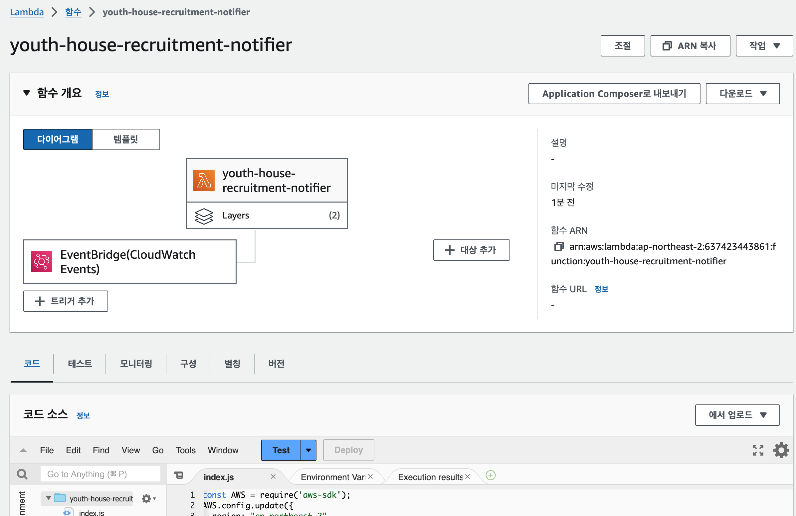
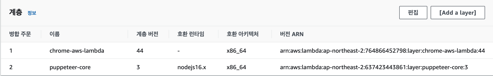
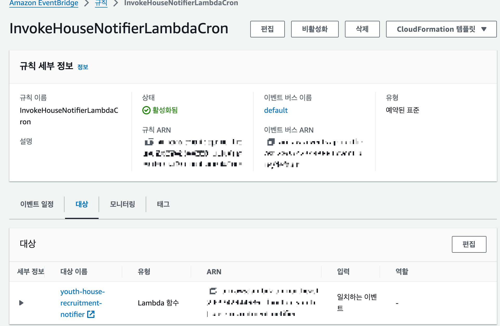
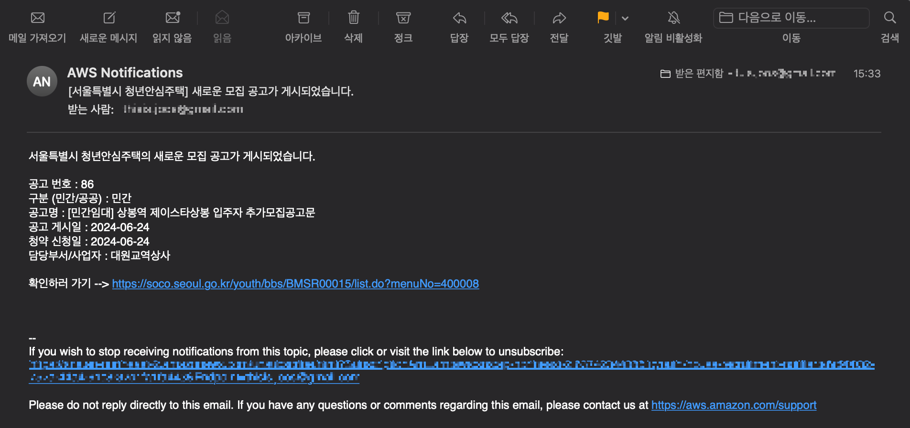

# 서울특별시 청년안심주택 모집공고 게시 알리미
[서울특별시 청년안심주택 모집공고 바로가기](https://soco.seoul.go.kr/youth/bbs/BMSR00015/list.do?menuNo=400008)

이 서비스는 서울특별시 청년안심주택의 새로운 모집공고가 올라올 경우 등록한 이메일 주소로 알림 메일을 보내주는 서비스입니다.

---

## 사용 기술

1. **Amazon EventBridge**
   - Amazon EventBridge에서 12시간마다 Lambda 함수를 트리거합니다.

2. **AWS Lambda**
   - Lambda 함수는 서울특별시 청년안심주택 모집공고 페이지에서 최신 공고 게시글의 인덱스를 스크래핑합니다.
   - 스크래핑된 최신 인덱스를 S3 버킷에 저장된 이전 인덱스와 비교합니다.
   - 인덱스가 일치하지 않을 경우 새로운 공고가 올라온 것으로 판단하고, 게시글 정보를 추출합니다.

3. **Amazon S3**
   - Lambda 함수가 실행될 때 수집한 최신 공고 게시글의 인덱스가 담긴 객체 파일을 저장합니다.

4. **Amazon Simple Notification Service (Amazon SNS)**
   - 추출된 정보를 바탕으로 이메일 내용을 구성하여, Amazon Simple Notification Service(Amazon SNS)를 이용해 Topic을 구독하고 있는 이메일 주소로 메일을 전송합니다.

---

## 사용 방법

1. IAM 역할 생성 
   - S3 Get, Put 허용
   - Amazon SNS 접근 권한 허용

2. Amazon SNS 주제 생성
   - 알림 받고자 하는 메일 주소 구독   
   - 

   
3. S3 버킷 생성
   - `latest_index.txt` 객체 생성

4. Lambda 함수 생성
   - 런타임 : Node.js 16.x
   - 아키텍처 : x86_64
   - 환경변수 설정 : {SNS_TOPIC_ARN}, {S3_BUCKET}
   - 계층 추가 :
     1. chrome-aws-lambda : `arn:aws:lambda:ap-northeast-2:764866452798:layer:chrome-aws-lambda:44`
     2. puppeteer-core : 수동으로 계층 추가 - [nodejs.zip](https://github.com/thisIsJooS/youth-house-recruitment-notifier/blob/main/assets/nodejs.zip)
   - 
   - 

5. Amazon EventBridge 규칙 생성 
   - 일정 정의 -> 지정한 시간 주기로 Lambda 함수 호출
   - 

---

## 결과

